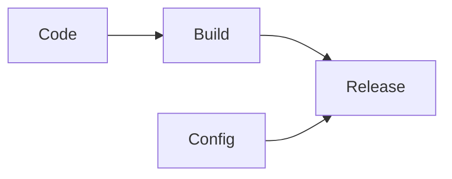

# V. Build, release, run
> V. 构建，发布，运行

Strictly separate build and run stages
> 严格分离构建和运行

A codebase is transformed into a (non-development) deploy through three stages:
> 基准代码 转化为一份部署(非开发环境)需要以下三个阶段：

* The build stage is a transform which converts a code repo into an executable bundle known as a build. Using a version of the code at a commit specified by the deployment process, the build stage fetches vendors dependencies and compiles binaries and assets.

> 构建阶段 是指将代码仓库转化为可执行包的过程。构建时会使用指定版本的代码，获取和打包 依赖项，编译成二进制文件和资源文件。

* The release stage takes the build produced by the build stage and combines it with the deploy’s current config. The resulting release contains both the build and the config and is ready for immediate execution in the execution environment.
> 发布阶段 会将构建的结果和当前部署所需 配置 相结合，并能够立刻在运行环境中投入使用。

* The run stage (also known as “runtime”) runs the app in the execution environment, by launching some set of the app’s processes against a selected release.
Code becomes a build, which is combined with config to create a release.
> 运行阶段 （或者说“运行时”）是指针对选定的发布版本，在执行环境中启动一系列应用程序 进程。

The twelve-factor app uses strict separation between the build, release, and run stages. For example, it is impossible to make changes to the code at runtime, since there is no way to propagate those changes back to the build stage.
> 12-factor 应用严格区分构建，发布，运行这三个步骤。 举例来说，直接修改处于运行状态的代码是非常不可取的做法，因为这些修改很难再同步回构建步骤。

Deployment tools typically offer release management tools, most notably the ability to roll back to a previous release. For example, the Capistrano deployment tool stores releases in a subdirectory named releases, where the current release is a symlink to the current release directory. Its rollback command makes it easy to quickly roll back to a previous release.
> 部署工具通常都提供了发布管理工具，最引人注目的功能是退回至较旧的发布版本。比如， Capistrano 将所有发布版本都存储在一个叫 releases 的子目录中，当前的在线版本只需映射至对应的目录即可。该工具的 rollback 命令可以很容易地实现回退版本的功能。

Every release should always have a unique release ID, such as a timestamp of the release (such as 2011-04-06-20:32:17) or an incrementing number (such as v100). Releases are an append-only ledger and a release cannot be mutated once it is created. Any change must create a new release.
> 每一个发布版本必须对应一个唯一的发布 ID，例如可以使用发布时的时间戳（2011-04-06-20:32:17），亦或是一个增长的数字（v100）。发布的版本就像一本只能追加的账本，一旦发布就不可修改，任何的变动都应该产生一个新的发布版本。

Builds are initiated by the app’s developers whenever new code is deployed. Runtime execution, by contrast, can happen automatically in cases such as a server reboot, or a crashed process being restarted by the process manager. Therefore, the run stage should be kept to as few moving parts as possible, since problems that prevent an app from running can cause it to break in the middle of the night when no developers are on hand. The build stage can be more complex, since errors are always in the foreground for a developer who is driving the deploy.
> 新的代码在部署之前，需要开发人员触发构建操作。但是，运行阶段不一定需要人为触发，而是可以自动进行。如服务器重启，或是进程管理器重启了一个崩溃的进程。因此，运行阶段应该保持尽可能少的模块，这样假设半夜发生系统故障而开发人员又捉襟见肘也不会引起太大问题。构建阶段是可以相对复杂一些的，因为错误信息能够立刻展示在开发人员面前，从而得到妥善处理。