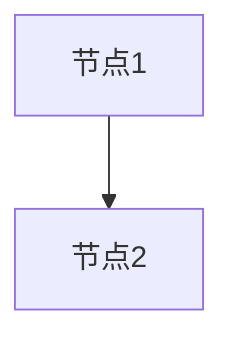
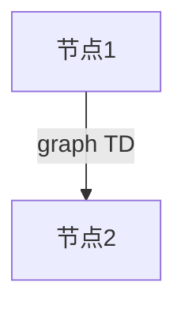
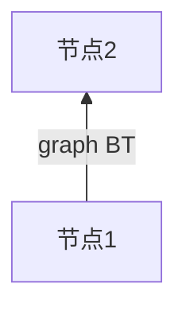
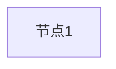
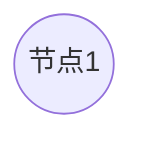
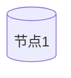

# Mermaid 画流程图 ( graph )

graph 简单示例



```md
graph
节点1 --> 节点2
```

## 方向
### 从上到下（默认）
```md
graph TB
节点1 --graph TB--> 节点2
```


### 从上到下
```md
graph TD
节点1 --graph TD--> 节点2
```


### 从下到上
```md
graph BT
节点1 --graph BT--> 节点2
```


### 从左到右
```md
graph LR
节点1 --graph LR--> 节点2
```

### 从右到左
```md
graph RL
节点1 --graph RL--> 节点2
```


|key|en|解释 |
| --- | --- | ---|
| graph TB | top -> bottom | 从上到下 | |
| graph TD | top -> drop | 从上到下 |
| graph BT | bottom -> top | 从下到上 |
| graph LR | left -> right | 从左到右 |
| graph RL | right -> left | 从右到左 |


## 连接线
### 线形
直线
```md
graph LR
节点1 --- 节点2
```


```md
graph LR
节点1 --> 节点2
```


```md
graph LR
节点1 --文案--- 节点2
```


粗直线
```md
graph LR
节点1 === 节点2
```


```md
graph LR
节点1 ==> 节点2
```


```md
graph LR
节点1 ==文案=== 节点2
```


虚线
```md
graph LR
节点1 -.- 节点2
```


```md
graph LR
节点1 -.-> 节点2
```


```md
graph LR
节点1 -.文案.- 节点2
```


| 形状 | 语法|
| --- | --- |
| 直线 | --- |
| 直线箭头 | --> |
| 直线 + 内容 | --内容--- |
| 直线加长版 | ---- |
| 直线加长版 + 内容 | --内容---- |
| 粗直线 | === |
| 粗直线箭头 | ==> |
| 粗直线 + 内容 | \==内容=== |
| 粗直线加长版 | ==== |
| 粗直线加长版 + 内容 | \==内容==== |
| 虚线 | -.- |
| 虚线箭头 | -.-> |
| 虚线 + 内容 | -.内容.- |
| 虚线加长版 | -..- |
| 虚线加长版 + 内容 | -.内容..- |


## 节点形状

默认

```md
graph LR
节点1
```


圆角

```md
graph LR
id1(节点1)
```


圆
```md
graph LR
id1((节点1))
```


椭圆

```md
graph LR
id1([节点1])
```


圆柱

```md
graph LR
id1[(节点1)]
```


菱形
```md
graph LR
id1{节点1}
```
```mermaid
graph LR
id1{节点1}
```

六边形
```md
graph LR
id1{{节点1}}
```
```mermaid
graph LR
id1{{节点1}}
```

平行四边形/梯形
```md
graph LR
id1[/节点1/]
```
```mermaid
graph LR
id1[/节点1/]
```

```md
graph LR
id1[\节点1\]
```
```mermaid
graph LR
id1[\节点1\]
```

```md
graph LR
id1[/节点1\]
```
```mermaid
graph LR
id1[/节点1\]
```

```md
graph LR
id1[\节点1/]
```
```mermaid
graph LR
id1[\节点1/]
```

不规则图形

```md
graph LR
id1>节点1]
```
```mermaid
graph LR
id1>节点1]
```

## 子图
```mermaid
graph LR
  subgraph one
    a1-->a2
  end
```

## 例子


```mermaid
graph TB

subgraph 祖辈
  yeye([爷爷])
  nainai([奶奶])
end

subgraph 外祖
  waigong([外公])
  waipo([外婆])
end

subgraph 父辈
  baba([爸爸])
  mama([妈妈])
end

xiaoming([小明])

yeye --> baba
nainai --> baba
waigong --> mama
waipo --> mama

baba --> xiaoming
mama --> xiaoming

```

```mermaid
graph LR
start((购物流程)) --> selectGoods([选择商品])

subgraph 商品模块
  selectGoods --> selectAttr([选择规格])
end

subgraph 订单模块
  selectAttr --> isHasCoupon{是否有优惠券}
  isHasCoupon --是--> selectCoupon([选择优惠券])
  selectCoupon --> createOrder([下单支付])
  isHasCoupon --否--> createOrder
end
```

## 参考
[mermaid](https://mermaid-js.github.io/mermaid/#/flowchart)