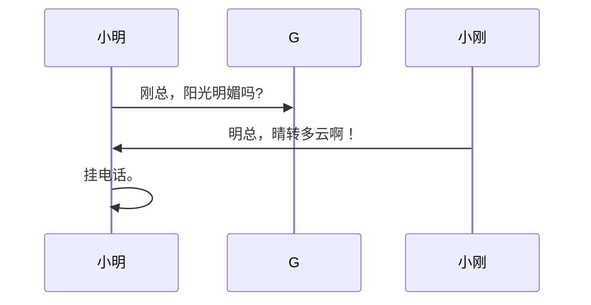
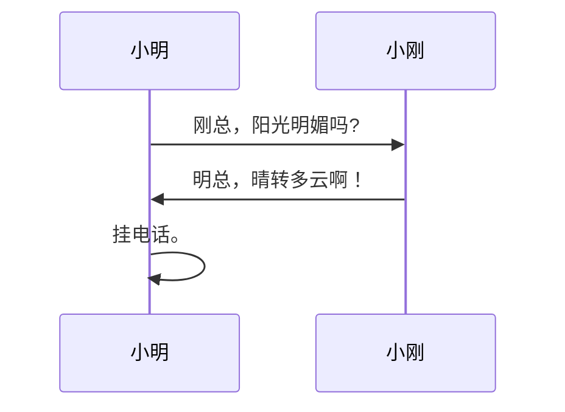
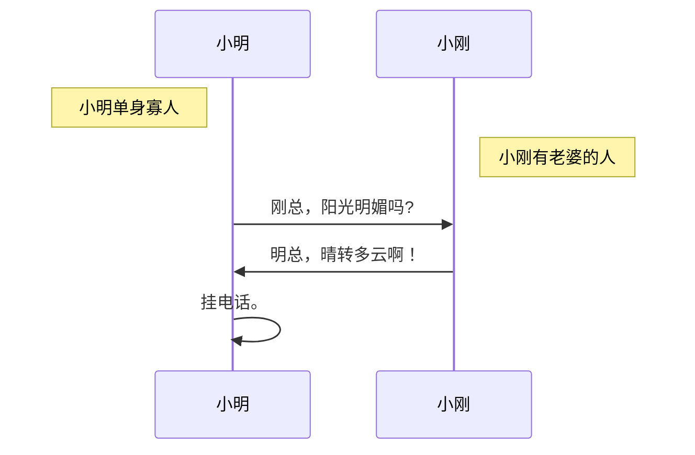
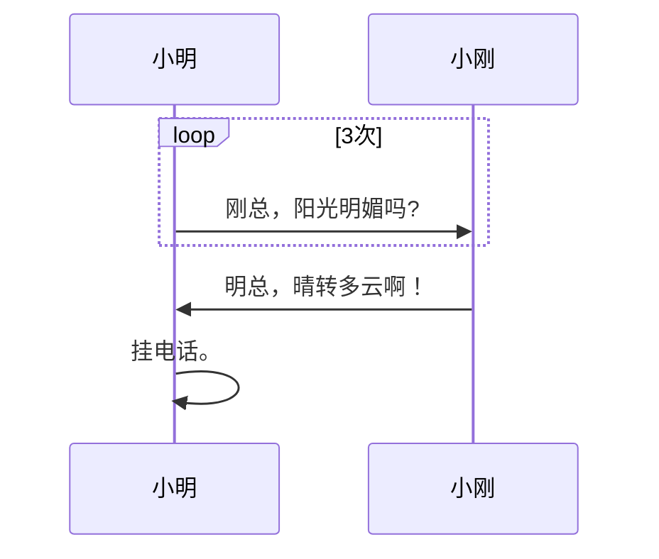
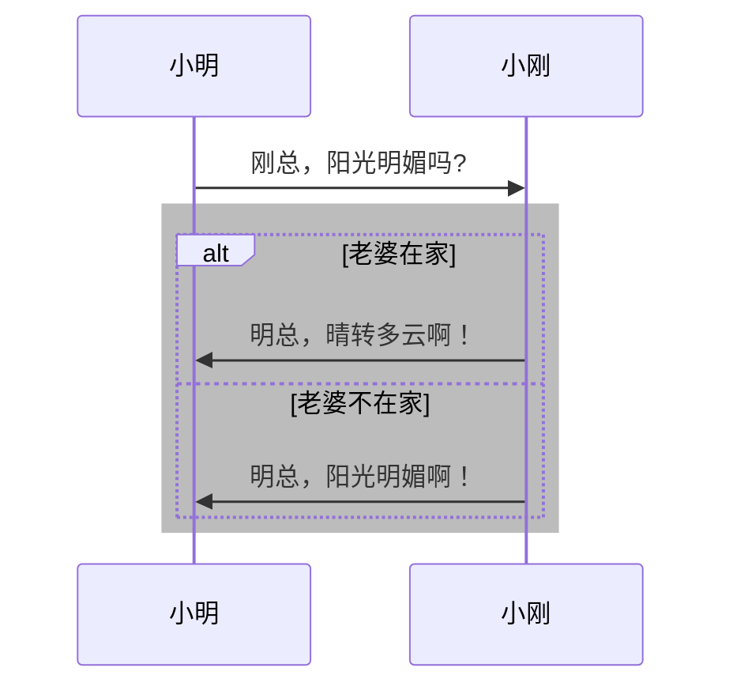

# Mermaid 画时序图 (sequenceDiagram)

> 时序图显示进程如何相互操作以及以何种顺序运行。
> 
```md
sequenceDiagram
  小明->>G: 刚总，阳光明媚吗?
  小刚->>小明: 明总，晴转多云啊！
  小明->>小明: 挂电话。
```


## 别名
```md
sequenceDiagram
  
  participant M as 小明
  participant G as 小刚

  M->>G: 刚总，阳光明媚吗?
  G->>M: 明总，晴转多云啊！
  M->>M: 挂电话。
```



## 笔记
```md
sequenceDiagram
  
  participant M as 小明
  Note left of M: 小明单身寡人
  participant G as 小刚
  Note right of G: 小刚有老婆的人

  M->>G: 刚总，阳光明媚吗?
  G->>M: 明总，晴转多云啊！
  M->>M: 挂电话。
```



## 循环
```md
sequenceDiagram
  
  participant M as 小明
  participant G as 小刚

  loop 3次
    M->>G: 刚总，阳光明媚吗?
  end
    G->>M: 明总，晴转多云啊！
  M->>M: 挂电话。
```


## 条件
```md
sequenceDiagram
  
  participant M as 小明
  participant G as 小刚

  M->>G: 刚总，阳光明媚吗?
  
  rect rgb(188,188,188)
    alt 老婆在家
      G->>M: 明总，晴转多云啊！
    else 老婆不在家
      G->>M: 明总，阳光明媚啊！
    end
  end

```


