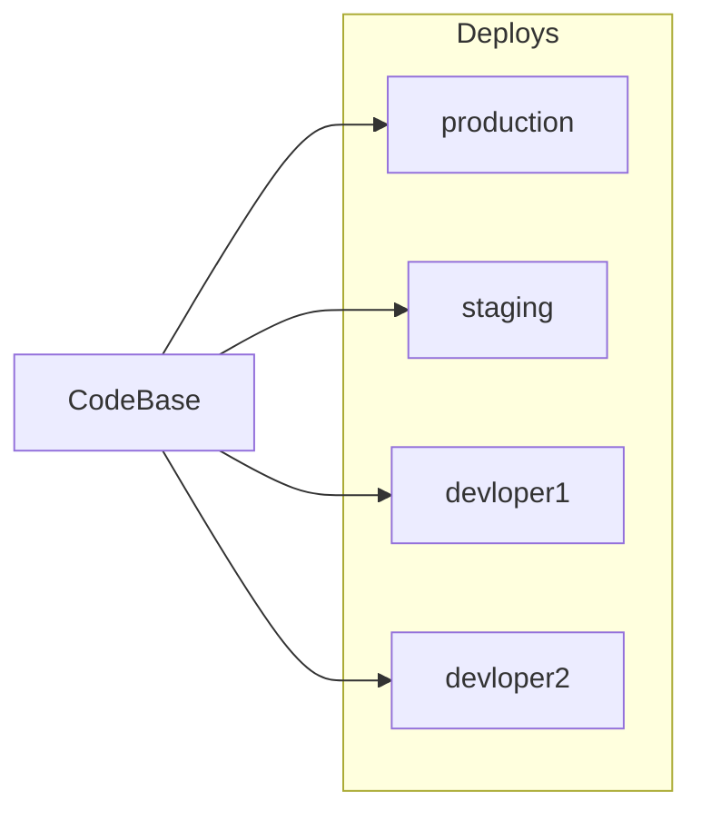

# I. Codebase
> I. 基准代码

One codebase tracked in revision control, many deploys
> 一份基准代码（Codebase），多份部署（deploy）

A twelve-factor app is always tracked in a version control system, such as Git, Mercurial, or Subversion. A copy of the revision tracking database is known as a code repository, often shortened to code repo or just repo.
> 12-Factor应用(译者注：应该是说一个使用本文概念来设计的应用，下同)通常会使用版本控制系统加以管理，如Git, Mercurial, Subversion。一份用来跟踪代码所有修订版本的数据库被称作 代码库（code repository, code repo, repo）。

A codebase is any single repo (in a centralized revision control system like Subversion), or any set of repos who share a root commit (in a decentralized revision control system like Git).

> 在类似 SVN 这样的集中式版本控制系统中，基准代码 就是指控制系统中的这一份代码库；而在 Git 那样的分布式版本控制系统中，基准代码 则是指最上游的那份代码库。

<!-- 一份代码库对应多份部署 -->

There is always a one-to-one correlation between the codebase and the app:
> 基准代码和应用之间总是保持一一对应的关系：

* If there are multiple codebases, it’s not an app – it’s a distributed system. Each component in a distributed system is an app, and each can individually comply with twelve-factor.
> 一旦有多个基准代码，就不能称为一个应用，而是一个分布式系统。分布式系统中的每一个组件都是一个应用，每一个应用可以分别使用 12-Factor 进行开发。

* Multiple apps sharing the same code is a violation of twelve-factor. The solution here is to factor shared code into libraries which can be included through the dependency manager.
> 多个应用共享一份基准代码是有悖于 12-Factor 原则的。解决方案是将共享的代码拆分为独立的类库，然后使用 依赖管理 策略去加载它们。

There is only one codebase per app, but there will be many deploys of the app. A deploy is a running instance of the app. This is typically a production site, and one or more staging sites. Additionally, every developer has a copy of the app running in their local development environment, each of which also qualifies as a deploy.

> 尽管每个应用只对应一份基准代码，但可以同时存在多份部署。每份 部署 相当于运行了一个应用的实例。通常会有一个生产环境，一个或多个预发布环境。此外，每个开发人员都会在自己本地环境运行一个应用实例，这些都相当于一份部署。

The codebase is the same across all deploys, although different versions may be active in each deploy. For example, a developer has some commits not yet deployed to staging; staging has some commits not yet deployed to production. But they all share the same codebase, thus making them identifiable as different deploys of the same app.

> 所有部署的基准代码相同，但每份部署可以使用其不同的版本。比如，开发人员可能有一些提交还没有同步至预发布环境；预发布环境也有一些提交没有同步至生产环境。但它们都共享一份基准代码，我们就认为它们只是相同应用的不同部署而已。
