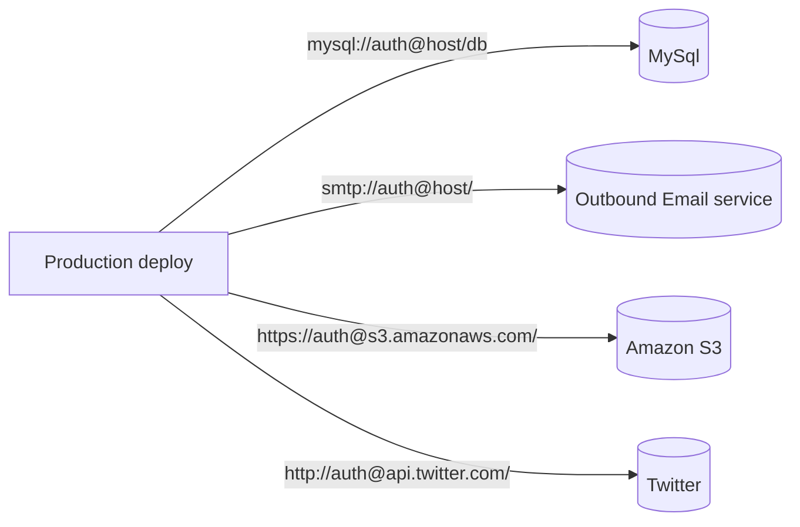

# IV. Backing services
> IV. 后端服务

Treat backing services as attached resources
> 把后端服务(backing services)当作附加资源

A backing service is any service the app consumes over the network as part of its normal operation. Examples include datastores (such as MySQL or CouchDB), messaging/queueing systems (such as RabbitMQ or Beanstalkd), SMTP services for outbound email (such as Postfix), and caching systems (such as Memcached).
> 后端服务是指程序运行所需要的通过网络调用的各种服务，如数据库（MySQL，CouchDB），消息/队列系统（RabbitMQ，Beanstalkd），SMTP 邮件发送服务（Postfix），以及缓存系统（Memcached）。

Backing services like the database are traditionally managed by the same systems administrators who deploy the app’s runtime. In addition to these locally-managed services, the app may also have services provided and managed by third parties. Examples include SMTP services (such as Postmark), metrics-gathering services (such as New Relic or Loggly), binary asset services (such as Amazon S3), and even API-accessible consumer services (such as Twitter, Google Maps, or Last.fm).
> 类似数据库的后端服务，通常由部署应用程序的系统管理员一起管理。除了本地服务之外，应用程序有可能使用了第三方发布和管理的服务。示例包括 SMTP（例如 Postmark），数据收集服务（例如 New Relic 或 Loggly），数据存储服务（如 Amazon S3），以及使用 API 访问的服务（例如 Twitter, Google Maps, Last.fm）。

The code for a twelve-factor app makes no distinction between local and third party services. To the app, both are attached resources, accessed via a URL or other locator/credentials stored in the config. A deploy of the twelve-factor app should be able to swap out a local MySQL database with one managed by a third party (such as Amazon RDS) without any changes to the app’s code. Likewise, a local SMTP server could be swapped with a third-party SMTP service (such as Postmark) without code changes. In both cases, only the resource handle in the config needs to change.
> 12-Factor 应用不会区别对待本地或第三方服务。 对应用程序而言，两种都是附加资源，通过一个 url 或是其他存储在 配置 中的服务定位/服务证书来获取数据。12-Factor 应用的任意 部署 ，都应该可以在不进行任何代码改动的情况下，将本地 MySQL 数据库换成第三方服务（例如 Amazon RDS）。类似的，本地 SMTP 服务应该也可以和第三方 SMTP 服务（例如 Postmark ）互换。上述 2 个例子中，仅需修改配置中的资源地址。

Each distinct backing service is a resource. For example, a MySQL database is a resource; two MySQL databases (used for sharding at the application layer) qualify as two distinct resources. The twelve-factor app treats these databases as attached resources, which indicates their loose coupling to the deploy they are attached to.
> 每个不同的后端服务是一份 资源 。例如，一个 MySQL 数据库是一个资源，两个 MySQL 数据库（用来数据分区）就被当作是 2 个不同的资源。12-Factor 应用将这些数据库都视作 附加资源 ，这些资源和它们附属的部署保持松耦合。

Resources can be attached to and detached from deploys at will. For example, if the app’s database is misbehaving due to a hardware issue, the app’s administrator might spin up a new database server restored from a recent backup. The current production database could be detached, and the new database attached – all without any code changes.
> 部署可以按需加载或卸载资源。例如，如果应用的数据库服务由于硬件问题出现异常，管理员可以从最近的备份中恢复一个数据库，卸载当前的数据库，然后加载新的数据库 – 整个过程都不需要修改代码。