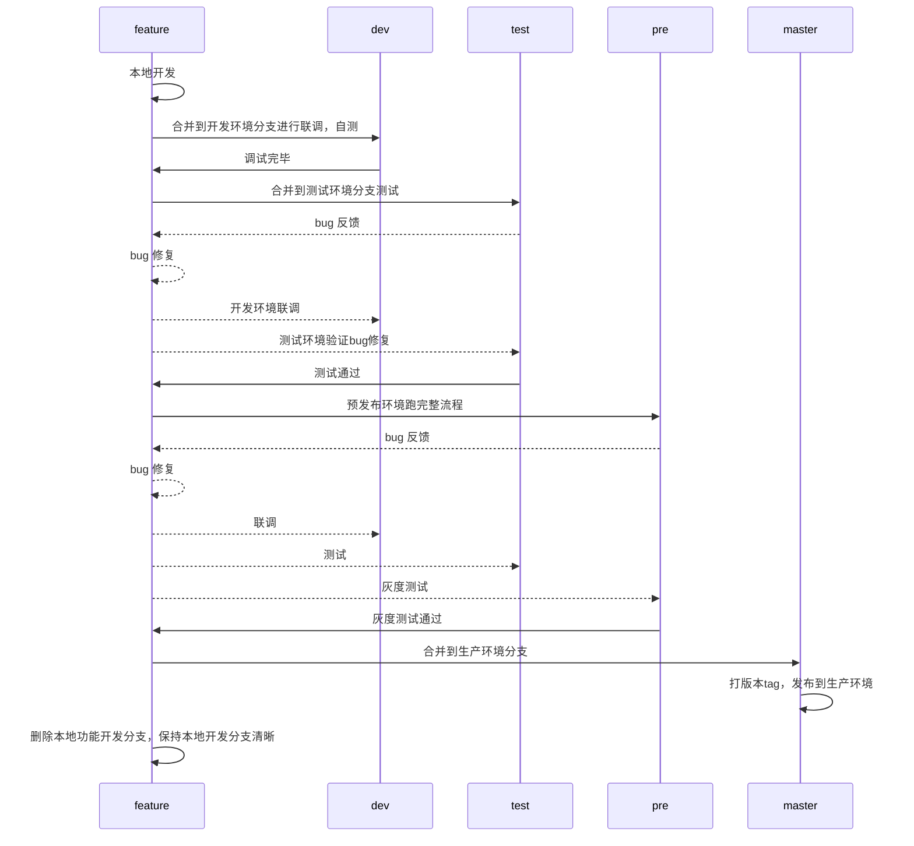

Git

# Git 在项目中的一种管理方式

我们在个人项目上使用 git 往往比较随心随意，下面记录一种团队开发时比较稳妥的 git 使用方式，需要的命令也是非常基本，不涉及高难度操作。

```mermaid
sequenceDiagram
feature ->> feature: 本地开发
feature ->> dev: 合并到开发环境分支进行联调，自测
dev ->> feature: 调试完毕
feature ->> test: 合并到测试环境分支测试
test -->> feature: bug 反馈
feature -->> feature: bug 修复
feature -->> dev: 开发环境联调
feature -->> test: 测试环境验证bug修复
test ->> feature: 测试通过
feature ->> pre: 预发布环境跑完整流程
pre -->> feature: bug 反馈
feature -->> feature: bug 修复
feature -->> dev: 联调
feature -->> test: 测试
feature -->> pre: 灰度测试
pre ->> feature: 灰度测试通过
feature ->> master: 合并到生产环境分支
master ->> master: 打版本tag，发布到生产环境
feature ->> feature: 删除本地功能开发分支，保持本地开发分支清晰
```

