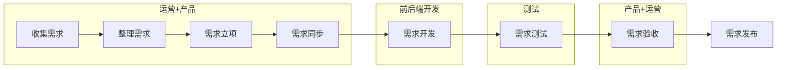
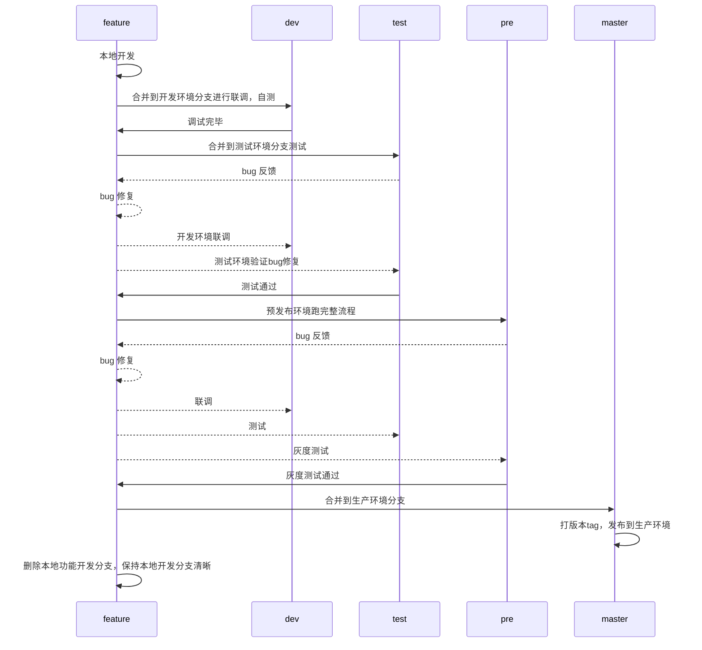

Git

# 团队开发中的版本管理

在[git在项目中的一种管理方式](./git在项目中的一种管理方式.md)中提出了一种比较稳妥的版本管理方式，但是没有很细地说明，只是通过图描述了一下流程。这次想详细说说我的想法。

## 从立项到上线

一个项目或者一个需求想要发布到生产环境中，必然有一个立项的过程，整个需求从立项到上线的生命周期，主要如下

大致流程是如上图所述的，但是其实开发会从需求同步开始，一直参与到需求发布。测试会从需求测试开始参与到发布。

其中从需求开发开始，也就是代码开始落实的第一步，开发组需要开始对需求进行项目代码层面的立项，由于涉及的人员众多，为了能顺利交付成果，对于代码的管理则变得尤其重要，而时至今日，懂得 git 的高级技巧的人其实并不多。与其让全员精通 git 的技巧，不如从管理分支上让大家都能更轻松地完成开发任务。

下面将从需求同步开始，大致描述下每个步骤中开发需要做的事情

- 需求同步：确定需求内容及范围，确定版本号（如 v1.2.3），这个版本号是由产品确定的，通常 1 表示重大版本升级，2 表示功能新增，3 表示小需求迭代，通常开发可能还要预留一个小的版本号，用于热修复之类的工作记录，所以版本号可能会变成 v1.2.3.4, 4 表示bug修复一类产品无立项的事情。
- 需求开发：需求涉及的开发组从指定的版本分支中进行开发及自测、联调等工作。
- 需求测试：测试对该需求进行测试，开发需要对测试结果进行debug。
- 需求验收：验收方对需求进行验收，有可能存在一些业务bug或调整，开发需要根据需求进行调整。
- 需求发布：验收完毕后由开发把代码提交到生产环境，或者开发配置某些工具，把发版权移交给其他人员。

可以看出来，其实每个步骤中，和开发打交道的人员并不完全一致，针对这些步骤，我们有了环境分支的概念，

**开发环境 (dev)**: 对应需求开发，使用人群为 开发人员
**测试环境 (test)**: 对应需求测试，使用人群为 开发人员、测试人员
**预发布环境 (pre)**: 对应需求验收，使用人群为 开发人员、测试人员、产品+运营
**生产环境 (master)**: 对应需求发布，使用人群为 客户群体

出了环境分支，我们还有和需求对应的 feature 分支: 
**feature (0.0.1)**: 规定了需求范围。

此外还有用于bug修复的 bugfix 分支以及 hotfix 分支
**bugfix(bugfix-somebugs)**: 用于修复发布后才被发现的一些 bug
**hotfix(hotfix-somebugs)**: 用于修复一些发布后才被发现的bug，常见于 Client/Server 架构的服务，用于发布热修复，但又不值得发布一个整包，Browser/Server 架构的服务基本没有这种需求；这里仅提一下，不展开讲。

## 建立分支

一切分支均来自于 master 分支（生产环境分支，如果你的生产环境分支是prod或者别的，请从你的生产分支进行操作）
首先我们从 master 分支新建 另外 3 个环境分支，分别是 dev、test、pre

对于新需求的 0.0.1 功能，也是从master分支建立，当然，如果0.0.1还未发布，而 0.0.2 又依赖于 0.0.1，此时可以从 0.0.1 创建 0.0.2 分支。

由于所有分支来自 master 分支，所以各个分支均可合并 master 分支代码；但**不允许**其他分支互相合并或者把环境分支合并到 master 分支。环境分支最好能互相独立。

## 分支功能稳定性
从上面的介绍可以看出，由于各个环境的用途不一，各个环境的稳定性也是不一样的

**feature**: 稳定性差，功能完成时需要自测。

**dev**: 经过自测，比feature 略稳定，但由于联调还算需求开发内，稳定性依然是差，联调完毕仍需自测。

**test**: 经过联调自测，功能应该能走通流程，但可能存在较多不易发现的bug，需要进一步修复bug。

**pre**: 经过测试及bug修复，可能有少数甚至没有bug了，稳定性良好，没问题可以由验收方验收。

**master**: 经过验收方验收，稳定性好，可发布。

## 开发流程

## 总结

这篇主要是给上一篇文章的一个说明补充。在使用版本管理之前，我们应该达成几个共识和约定：

1. git 提供了基础的分支管理功能以及历史提交功能，并不限制你的使用方式；
2. 环境分支的意义在于可以让不同的使用人群参与其中，不会被其他人群的操作干扰，比如，在 test 的测试人员不会因为 dev 正在开发的未提测的功能阻碍到； 
3. feature 分支实际上是版本分支，是整个开发团队需要达成的一种共识，代表了这个 feature 在未来上线时需要合并到 master 的代码合集，当然在 feature 内容不多的情况下可以当作开发分支使用，但是 feature 包含的功能足够多时，对 feature 再细分几个小分支可能是更好的选择；
4. 在团队的代码管理中，为了消除差异性，我们应该使用尽量简单的操作来完成版本管理，但不代表团队可以没有对 git 足够熟悉的人，在一些特殊情况中，对 git 熟悉的人总是可以保持头脑冷静。
5. 同一个版本的内容，不同的项目使用同一个版本号可以更好的沟通，比如：产品确定版本号 0.0.1，前端设置web端项目版本号 0.0.1, 后台项目 0.0.1，后端项目设置版本号 0.0.1，未来提交到各个环境时即可保证整套项目的版本是统一的，降低了沟通成本。
